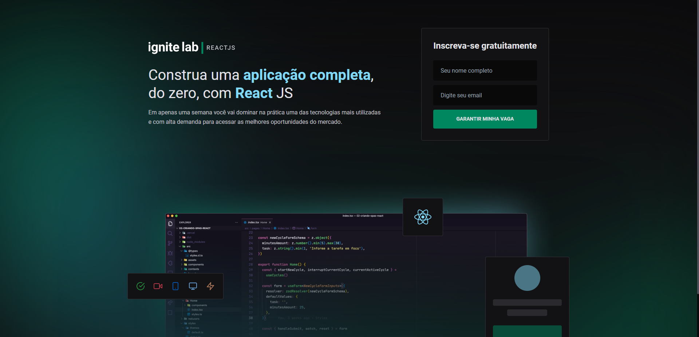
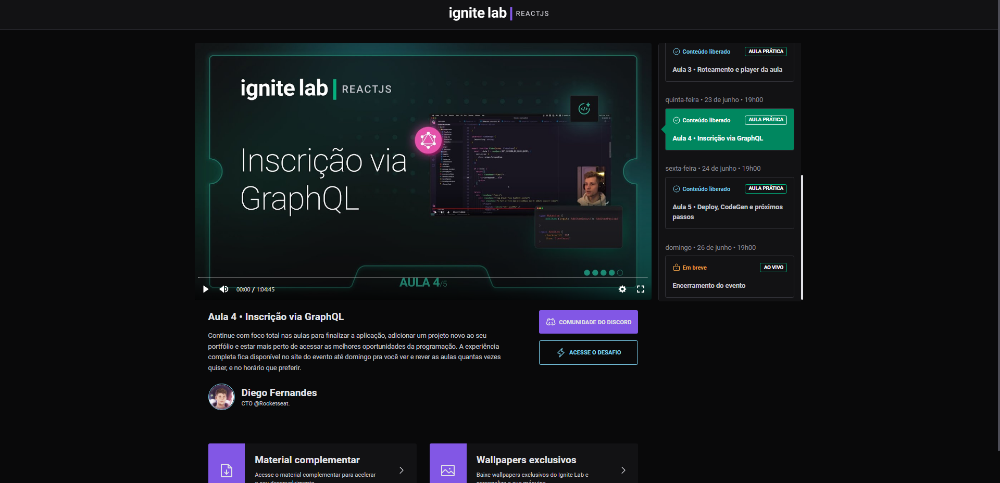

<h1 align='center'>
  Online Classes Platform 💻
</h1>




### 🚀 Stack
* [Vite](https://vitejs.dev/)
* [React JS](https://pt-br.reactjs.org/)
* [React-router-dom](https://github.com/remix-run/react-router)
* [Headless CMS (Content Management System) com GraphCMS](https://hygraph.com/)
* [GraphQL](https://graphql.org/)
* [GraphQL Codegen](https://www.graphql-code-generator.com/)
* [TypeScript](https://www.typescriptlang.org/)
* [TailwindCSS](https://tailwindcss.com/)
* [Vime/React](https://vimejs.com/getting-started/installation)

## Layout
Você pode visualizar o layout do projeto através [desse link](https://www.figma.com/community/file/1120711251998877938). É necessário ter conta no [Figma](http://figma.com/) para acessá-lo.

## Executando o projeto

Pelo seu terminal navegue até a pasta do projeto e execute:

```cl
  npm install
  npm run dev (yarn dev)

```

## :memo: License

Esse projeto está sob a licença MIT. Veja o arquivo [LICENSE](LICENSE.md) para mais detalhes.

Feito com ♥ by Thiago Lourenço.